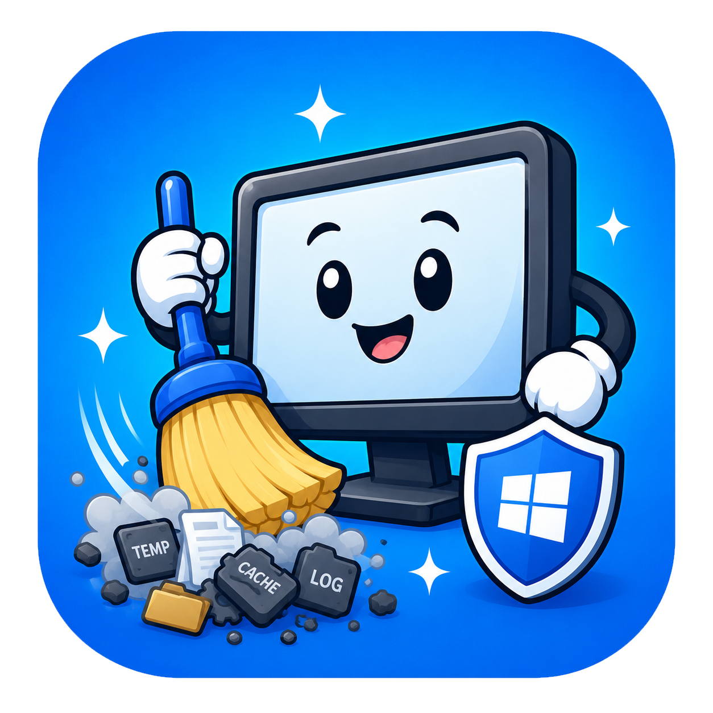
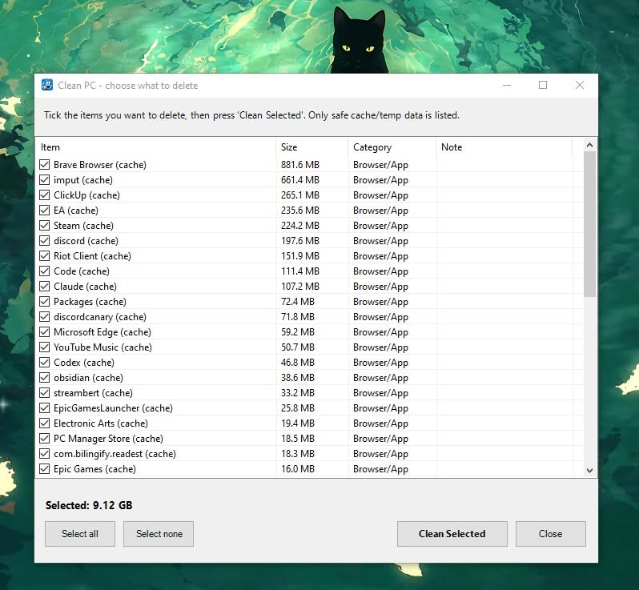

# PC Cache Cleaner

<p align="center">
  
</p>

A portable Windows 10/11 cache & temp cleaner. It auto-detects what your PC has
— NVIDIA / AMD / Intel GPU caches, any installed browser, dev tools, Electron
apps — and frees disk space by deleting **only regenerable cache and temp
data**. Download one file, run it, tick what to clear, done.

> **Safety first:** it never touches your personal files, browser logins,
> history, bookmarks, passwords, installed programs, or saved games. See
> [What it will never touch](#what-it-will-never-touch).

---

## Download & run

1. Go to the [**Releases**](../../releases/latest) page and download
   **`CleanPC.exe`**.
2. Double-click it. Windows asks for administrator permission (needed to clear
   system temp and the Windows Update cache) — click **Yes**.
3. It scans your PC, then shows a checklist with each item's size. Tick what you
   want, press **Clean Selected**, and it reports how much space it freed. You
   can press **Cancel** mid-run to stop after the current item (already-freed
   space is kept; nothing is left half-deleted).

<p align="center">
  
</p>

### "Windows protected your PC" on first run

The app isn't code-signed (a signing certificate costs money), so Windows
SmartScreen shows a blue warning the first time. This is expected for small
open-source tools. To run it:

> Click **More info** → **Run anyway**.

The full source is in this repo, so you can read exactly what it does before
trusting it.

---

## What it cleans

Anything not present on your PC is silently skipped, so the same app works on
any Windows 10/11 machine.

- Temp folders, app crash dumps, Windows Error Reporting
- GPU / shader caches: NVIDIA, AMD, Intel, DirectX
- Browser caches: Chrome, Edge, Brave, Opera, Vivaldi, Firefox (all profiles)
- App / Electron caches: Discord, Spotify, Slack, Teams, VS Code, and more
- Windows thumbnail / icon cache
- Developer package caches: pip, uv, npm, yarn, Go, NuGet, `~/.cache`
- **Optional (off by default):** Recycle Bin, Claude Desktop local-agent VM cache

## What it will never touch

Personal files. Browser tabs, sessions, cookies, logins, history, bookmarks,
and passwords. Installed programs and their settings. Saved games. Deleting a
cache only costs you a one-time, automatic re-download or rebuild — nothing you
care about is lost.

---

## Log file & troubleshooting

Every run writes **`CleanPC-log.txt`** next to the app, recording what was
scanned, what was freed, and anything it had to skip (for example, a file locked
by a running browser). If something behaves unexpectedly or crashes, the log
gets the error details too.

To get help, just **drag `CleanPC-log.txt` into an AI assistant** (or attach it
to an issue here) and ask what went wrong — it's plain text designed to be read.

Tip: close your browsers and chat apps before running for the most thorough
cleanup (open apps lock their own cache files, which are then safely skipped).

---

## For advanced users

The repo ships the raw PowerShell so you can read, audit, or script it:

- **`CleanPC-GUI.ps1`** — the graphical version (what the `.exe` wraps).
- **`Clean-PC-Cache.ps1`** — a no-UI console version for scripting/automation:

  ```powershell
  .\Clean-PC-Cache.ps1 -DryRun                 # report only, delete nothing
  .\Clean-PC-Cache.ps1 -Auto                   # no prompts, safe defaults
  .\Clean-PC-Cache.ps1 -Auto -IncludeRecycleBin -IncludeClaudeVM
  .\Clean-PC-Cache.ps1 -SkipDevCaches          # leave package caches alone
  ```

### Building the EXE yourself

```powershell
Install-Module ps2exe -Scope CurrentUser
Invoke-PS2EXE .\CleanPC-GUI.ps1 .\CleanPC.exe -requireAdmin -noConsole -title "PC Cache Cleaner"
```

---

## License

[MIT](LICENSE) — free to use, modify, and share.
